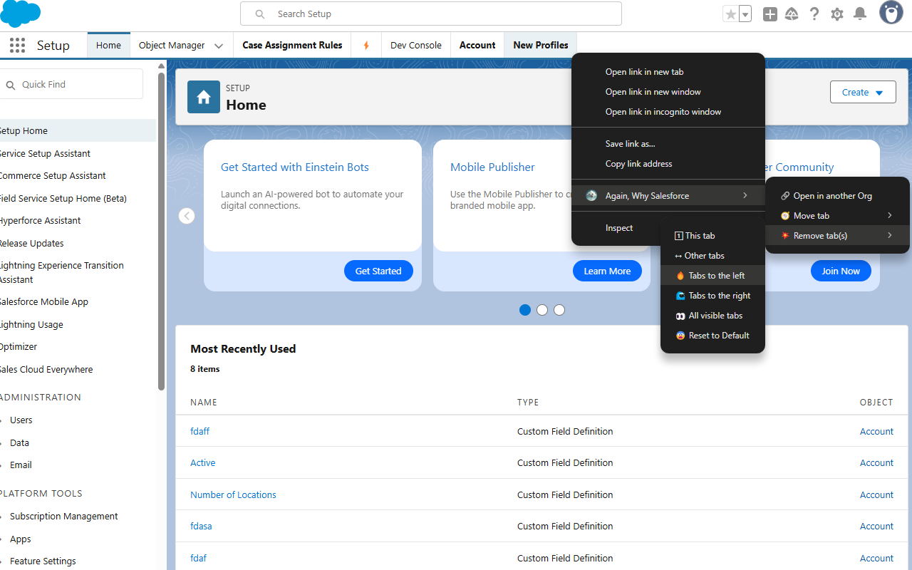

# Again, Why Salesforce

      

<!--

-->

This extension allows users to create custom tabs in Setup for their most-used settings.

This is a fork of [Why Salesforce](https://www.github.com/walters954/why-salesforce).

[Demo Video](https://youtu.be/BtlKRvac9ZQ)

## New Features

| Title                                                                                      | Image                                                                          |
| ------------------------------------------------------------------------------------------ | ------------------------------------------------------------------------------ |
| [Import Tabs](https://github.com/Astisme/again-why-salesforce/wiki/Open-Other-Org)         |      |
| Context Menus                                                                              |     |
| [Open in another org](https://github.com/Astisme/again-why-salesforce/wiki/Open-Other-Org) |  |
| Org specific Tabs                                                                          |          |
| [Fast save](https://github.com/Astisme/again-why-salesforce/wiki/Save-a-Tab)               |          |

## Install on browser

Click on the browser icon to be redirected to the extension page.

You may find the release for this extension [here](https://github.com/Astisme/again-why-salesforce/releases). You can download these releases to verify what is the code that's been uploaded to the extension stores.

If you prefer, you can build this extension by downloading it and running `deno task dev-(browser)` then add it to your browser following its specific steps.

## Contributing

All contributions are welcome. Please head to the [issues page](https://github.com/Astisme/again-why-salesforce/issues) and pick one unassigned issue to work on.

We'll assign it to you after you comment on it.

## Best Practices

The Best Practices followed by this project can be found [at this link](https://blog.jetbrains.com/webstorm/2024/10/javascript-best-practices-2024/).

## Contributors

- [Warren Walters](https://www.linkedin.com/in/walters954/)
- [Chris Rouse (Firefox port)](https://www.linkedin.com/in/chris-rouse/)
- [Astisme](https://www.github.com/Astisme/)
